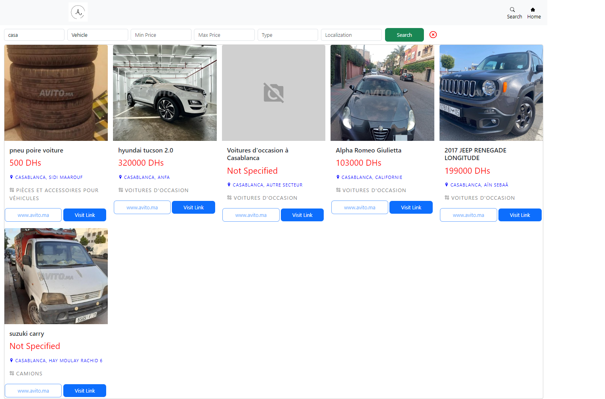
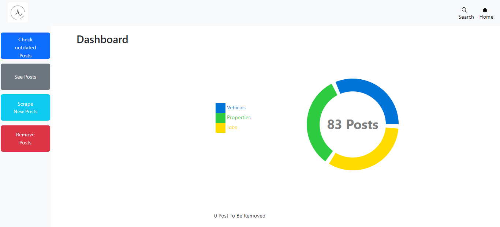

# Aleo

## Table des matières

- [Commencer](#commencer)
  - [Installation](#installation)
  - [Configuration](#configuration)
- [Technologies](#technologies)
  - [Backend](#backend)
  - [Frontend](#frontend)
  - [Base de données](#base-de-données)
- [Guide de l'Utilisateur](#guide-de-lutilisateur)
  - [Page d'Accueil](#page-daccueil)
  - [Page de Recherche](#page-de-recherche)
- [Section Administrateur](#section-administrateur)
  - [Tableau de Bord](#tableau-de-bord)
- [Documentation de l'API](#documentation-de-lapi)
  - [Obtenir Toutes les Annonces](#obtenir-toutes-les-annonces)
  - [Rechercher des Annonces](#rechercher-des-annonces)
  - [Scraping des Données](#scraping-des-données)
  - [Supprimer une Annonce par ID](#supprimer-une-annonce-par-id)
  - [Section Administrateur](#section-administrateur)
- [Équipe de Développement](#équipe-de-Développement)
  - [Abdelwahed Akhechane](#abdelwahed-akhechane)
  - [Zakariae Heddaje](#zakariae-heddaje)

## Commencer

Cette section vous guidera à travers les étapes initiales de configuration pour mettre en marche notre application web sur votre système.

### Installation

Pour commencer à utiliser notre application web, vous devrez cloner le dépôt depuis notre GitHub et mettre en place les dépendances nécessaires. Suivez ces étapes :

1. Cloner le Dépôt :

   ```bash
   git clone https://github.com/Abdoul54/Aleo.git
   cd Aleo
   ```

2. Installer les Dépendances :

#### Installtion du Frontend

Accédez au répertoire frontend et exécutez la commande suivante pour installer les dépendances listées dans le fichier `package.json`.

```bash
cd frontend
npm install
```

#### Installtion du Backend

Accédez au répertoire d'installation et exécutez la commande suivante pour installer les dépendances nécessaires listées dans le fichier `requirements.txt`.

```bash
cd backend
pip install -r requirements.txt
```

### Configuration

Une fois les dépendances installées, vous pouvez configurer l'application pour correspondre aux exigences et préférences de votre système.

1. **Variables d'Environnement :**
   Configurez les variables d'environnement que l'application pourrait nécessiter, telles que les clés d'API, les identifiants de la base de données et autres informations sensibles. Ces variables peuvent être définies dans un fichier `.env` à la racine de l'application.

   Exemple de fichier `.env` :

   ```
   MONGODB_URI = mongodb://localhost:27017/mabase
   ```

### Accès à l'Application

Avec l'installation et la configuration terminées, vous êtes prêt à accéder et utiliser l'application web. Ouvrez votre navigateur web préféré et saisissez l'URL fournie pendant le processus d'installation. Vous serez dirigé vers la page d'accueil, où vous pourrez commencer à explorer les annonces en fonction de vos intérêts.

## Technologies

Nous plongerons plus en profondeur dans les technologies qui alimentent notre application web, depuis l'infrastructure backend jusqu'à l'interface utilisateur frontend et la base de données qui fait tout fonctionner.

### Backend : Flask

Le backend de notre application web est développé avec Flask, un framework Python polyvalent et léger. Flask excelle dans la gestion des fonctionnalités essentielles qui font fonctionner l'application en douceur. Voici comment Flask contribue au succès de notre application web :

- **Itinéraires et Points d'Extrémité :** Flask simplifie les itinéraires en nous permettant de définir des routes correspondant à des fonctionnalités spécifiques de l'application. Chaque route est associée à une fonction qui gère la logique de cette fonctionnalité particulière, qu'il s'agisse de récupérer des données, de traiter des formulaires ou d'interagir avec la base de données.

- **Traitement des Données :** Flask sert de pont entre le frontend et la base de données. Il reçoit les demandes du frontend, traite les données et renvoie des réponses appropriées. L'utilisation des objets de requête et de réponse de Flask permet un traitement efficace et organisé des données.

- **Dépendances :**
  - `flask==2.3.2` : La bibliothèque de base de Flask qui forme le socle de notre backend.
  - `flask_cors==3.0.10` : Cette extension simplifie la gestion du partage des ressources entre domaines (CORS) pour permettre une communication sécurisée entre notre frontend et notre backend.
  - `pymongo==3.12.0` : La bibliothèque PyMongo nous offre une interface Python pour interagir avec la base de données MongoDB, facilitant le stockage et la récupération transparents des données.
  - `requests==2.27.1` : Nous utilisons la bibliothèque Requests pour gérer les requêtes et les réponses HTTP, assurant une communication fluide entre les différentes composantes de notre application.
  - `selenium==4.1.0` : Selenium est utilisé pour le scraping web, nous permettant de collecter des annonces actualisées à partir de sources externes variées.
  - `linkpreview==0.6.5` : Cette bibliothèque nous aide à générer des aperçus de liens pour les URL, améliorant l

'expérience utilisateur en fournissant des aperçus visuels du contenu externe.

### Frontend : React

Le frontend de notre application web est construit avec React, une bibliothèque JavaScript populaire réputée pour son architecture basée sur les composants. React améliore l'expérience utilisateur grâce à son design dynamique et interactif. Voici comment React façonne notre interface utilisateur :

- **Approche Basée sur les Composants :** La nature modulaire de React nous permet de créer des composants réutilisables. Chaque composant encapsule sa propre logique, ses styles et sa fonctionnalité. Il en résulte une base de code propre et maintenable, facilitant le développement et l'extension des fonctionnalités de notre application.

- **Bibliothèques d'Interface Utilisateur :** Nous tirons parti de différentes bibliothèques pour améliorer notre processus de développement frontend :

  - `@mui/material` : Cette bibliothèque fournit une collection de composants, de styles et de thèmes qui nous aident à créer des éléments d'interface moderne et réactive.
  - `bootstrap` et `react-bootstrap` : Ces bibliothèques offrent une gamme de composants et de styles pré-conçus, simplifiant le développement d'une interface utilisateur cohérente et visuellement attrayante.
  - `reactstrap` : Cette bibliothèque complète React en offrant des composants et une fonctionnalité supplémentaires qui s'intègrent parfaitement à la structure de notre application.

- **Gestion des Données :** Nous utilisons la bibliothèque `axios` pour gérer les requêtes HTTP entre le frontend et le backend. Cela garantit une communication efficace et un échange transparent des données.

- **Expérience Utilisateur :** La bibliothèque `react-icons` nous permet d'incorporer une grande variété d'icônes dans le design de notre application, améliorant l'interaction de l'utilisateur et l'attrait visuel.

- **Itinéraires et Navigation :** La bibliothèque `react-router-dom` nous permet de mettre en œuvre une navigation fluide entre différentes sections de notre application, garantissant une expérience de navigation sans heurts.

- **Visualisation des Données :** Pour répondre aux besoins de visualisation des données, nous utilisons la bibliothèque `recharts` pour créer des graphiques interactifs et visuellement attrayants.

- **Retours Utilisateur :** La bibliothèque `react-toastify` nous permet d'afficher des notifications informatives et conviviales, améliorant la communication des messages importants aux utilisateurs.

### Base de Données : MongoDB

MongoDB sert de pilier à notre gestion des données, permettant un stockage et une récupération efficaces des annonces. Voici comment MongoDB contribue à la robustesse de notre application :

- **Schéma Flexible :** La nature orientée document de MongoDB nous permet de stocker les données sous forme de documents flexibles plutôt que de lignes et de colonnes traditionnelles. Cette flexibilité permet de s'adapter à la structure diverse des annonces, qu'il s'agisse de véhicules, de propriétés ou d'offres d'emploi.

- **Évolutivité :** L'évolutivité de MongoDB garantit que notre application peut gérer un nombre croissant d'annonces et d'utilisateurs sans compromettre les performances. Ses capacités d'évolutivité horizontale nous permettent de distribuer les données sur plusieurs serveurs pour des performances optimisées.

- **Interrogation Efficace :** Le langage de requête puissant de MongoDB nous permet de récupérer des données spécifiques de manière efficace. Nous pouvons adapter les requêtes aux exigences des différentes catégories et filtres, garantissant aux utilisateurs des résultats précis et rapides.

## Guide de l'Utilisateur

Dans la section "Guide de l'Utilisateur", où nous vous guiderons à travers les différentes fonctionnalités de notre application web, vous permettant de tirer le meilleur parti de votre expérience.

### Page d'Accueil

La page d'accueil sert de point d'entrée dans l'application, offrant un aperçu des catégories disponibles : Véhicules, Propriétés et Emplois. Voici comment naviguer sur la page d'accueil :


1. **Sélection de Catégorie :**
   Cliquez sur la catégorie qui vous intéresse le plus. Chaque carte de catégorie affiche une image représentative et un nom, offrant un aperçu des annonces dans cette catégorie.

### Page de Recherche

La page de recherche vous permet de trouver des annonces spécifiques correspondant à vos critères. Voici comment utiliser la fonction de recherche :


1. **Barre de Recherche :**
   En haut de la page de recherche, vous trouverez une barre de recherche. Entrez des mots-clés liés à l'objet que vous recherchez, comme un modèle de voiture spécifique ou un titre d'emploi.

2. **Filtres :**
   Sous la barre de recherche, vous pouvez appliquer des filtres pour affiner votre recherche. Les options de filtrage peuvent inclure des gammes de prix minimales et maximales, des types d'objets (par exemple, emploi à temps plein, emploi à temps partiel) et une localisation.

3. **Résultats de Recherche :**
   Après avoir saisi des mots-clés et appliqué des filtres, les résultats de la recherche afficheront des annonces correspondant à vos critères. Cliquez sur une annonce pour afficher ses informations détaillées.

4. **Détails de l'Annonce :**
   La page de détails de chaque annonce fournit des informations complètes sur l'objet, telles que des images, des descriptions, des coordonnées et plus encore.

## Section Administrateur

En tant qu'administrateur de l'application, vous avez accès à des fonctionnalités spéciales pour superviser et gérer les opérations avancées de l'application. Voici comment utiliser les fonctionnalités de la section "Administrateur":

### Tableau de Bord

Dans le tableau de bord, vous pouvez obtenir un aperçu des statistiques clés et gérer les opérations de base.



1. **Aperçu des Statistiques :**
   Sur le tableau de bord, vous pouvez visualiser rapidement les statistiques importantes, notamment le nombre total d'annonces dans la base de données, le nombre d'annonces obsolètes et d'autres métriques pertinentes.

2. **Scraping de Nouvelles Annonces :**
   En tant qu'administrateur, vous pouvez initier manuellement le processus de scraping pour récupérer de nouvelles annonces à partir de sources externes. Cela permet de garantir que les annonces restent à jour et pertinentes pour les utilisateurs.

3. **Voir les Annonces :**
   La fonction "Voir les Annonces" vous permet d'accéder à la liste complète de toutes les annonces dans la base de données. Vous pouvez parcourir, filtrer et rechercher des annonces pour obtenir un aperçu complet.

4. **Vérifier les Annonces Obsolètes :**
   L'application propose une fonctionnalité pour vérifier et marquer les annonces obsolètes. Vous pouvez utiliser cette fonctionnalité pour maintenir la qualité de la base de données.

5. **Supprimer les Annonces Obsolètes :**
   Une fois les annonces obsolètes identifiées, vous pouvez les supprimer en toute simplicité pour maintenir la pertinence des données.

## Documentation de l'API

Cette section expliquera chaque API disponible avec leur route et leur méthode

### Obtenir Toutes les Annonces

- **Méthode HTTP :** GET
- **Route :** `/api/posts`
- **Description :** Récupérez un tableau JSON contenant toutes les annonces de la base de données.

### Rechercher des Annonces

- **Méthode HTTP :** GET
- **Route :** `/api/search/<category>/<q>`
- **Paramètres :** `<category>`, `<q>`
- **Paramètres de Requête :** `minPrice`, `maxPrice`, `type`, `localisation`
- **Description :** Recherchez des annonces en fonction de la catégorie et de la requête spécifiées, avec des filtres optionnels pour la plage de prix, le type et la localisation.

### Scraping des Données

- **Méthode HTTP :** GET
- **Route :** `/api/admin/scrape`
- **Description :** Les administrateurs peuvent initier le processus de scraping pour récupérer de nouvelles annonces à partir de sources externes. Cela garantit que les annonces de l'application restent à jour et pertinentes.

### Supprimer une Annonce par ID

- **Méthode HTTP :** GET
- **Route :** `/api/admin/delete/<id>`
- **Paramètres :** `<id>`
- **Description :** Supprimez une annonce spécifique de la base de données en fournissant son identifiant unique.

### Section Administrateur

En tant qu'administrateur, vous avez accès à des routes spéciales pour gérer les annonces et superviser les opérations de l'application.

#### Scraping de Nouvelles Annonces

- **Méthode HTTP :** GET
- **Route :** `/api/admin/posts/scrape`
- **Description :** Initiez le processus de scraping pour récupérer de nouvelles annonces à partir de sources externes.

#### Supprimer les Annonces

- **Méthode HTTP :** GET
- **Route :** `/api/admin/posts/delete`
- **Description :** Supprimez des annonces en fonction de leurs identifiants uniques pour maintenir la qualité des données.

#### Compter les Annonces

- **Méthode HTTP :** GET
- **Route :** `/api/admin/posts/count`
- **Description :** Récupérez le nombre total d'annonces dans la base de données pour la surveillance et l'évaluation.

#### Supprimer les Annonces Supprimables

- **Méthode HTTP :** GET
- **Route :** `/api/admin/posts/remove`
- **Description :** Supprimez efficacement les annonces obsolètes ou non pertinentes pour optimiser la qualité des données.

#### Vérifier le Compteur d'Annonces

- **Méthode HTTP :** GET
- **Route :** `/api/admin/posts/counter`
- **Description :** Vérifiez et mettez à jour le compteur des annonces supprimables pour garantir l'intégrité des données.

Certainly, you can add a section in your documentation to acknowledge and credit the team members who contributed to the development of the app. Here's an example of how you can include such a section:

## Équipe de Développement

Nous sommes fiers de présenter l'équipe qui a travaillé sur le développement de notre application web de listes d'annonces et de scraping. Chaque membre de notre équipe a apporté son expertise unique pour créer une expérience utilisateur exceptionnelle et des fonctionnalités robustes. Voici les membres de l'équipe :

### [Abdelwahed Akhechane](https://github.com/Abdoul54)

- Rôle : Développeur Backend
- Description : Abdelwahed était responsable de la conception et de la mise en œuvre du backend de l'application, en utilisant Flask et les dernières technologies pour assurer un flux de données fluide et une sécurité renforcée.

[Voir Profil Linkedin](https://www.linkedin.com/in/abdelwahed-akhechane/)

### [Zakariae Heddaje](https://github.com/zakariaeheddaje)

- Rôle : Développeur Frontend
- Description : Zakariae a dirigé le développement frontend en utilisant React et diverses bibliothèques pour créer une interface utilisateur moderne et intuitive. Ses compétences en conception ont apporté une touche esthétique à l'application.

[Voir Profil Linkedin](https://www.linkedin.com/in/zakariae-heddaje-867480234/)
